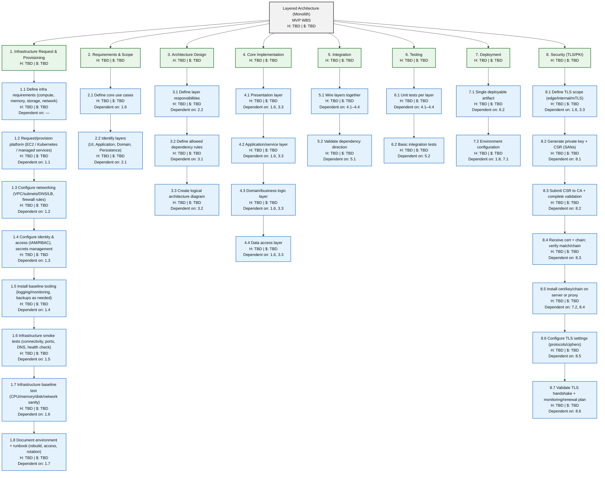
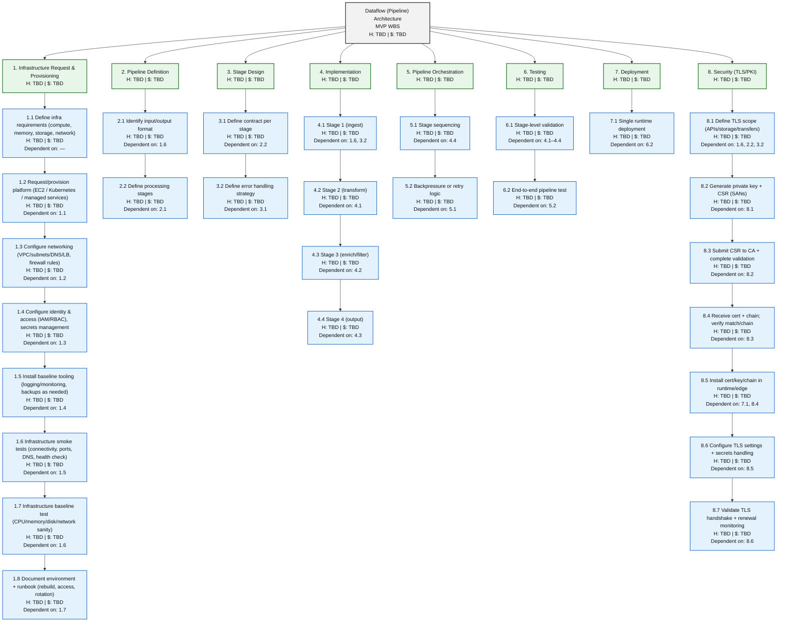
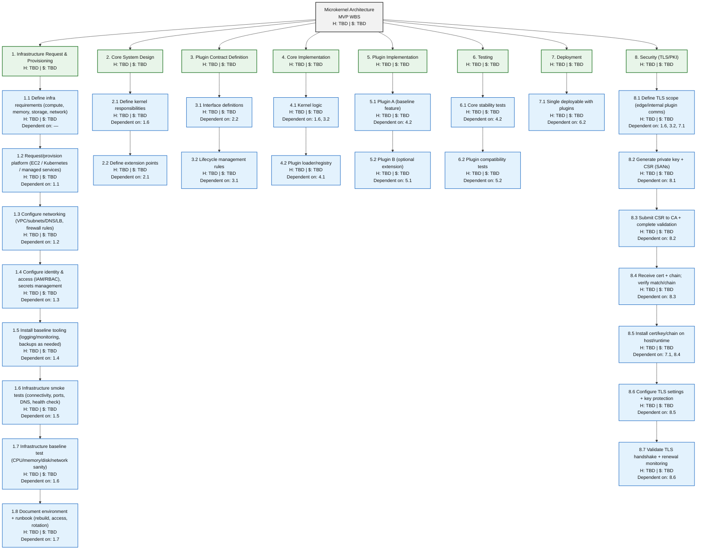
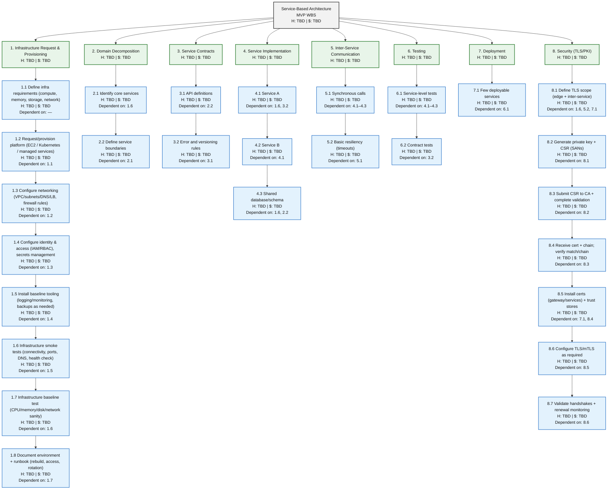
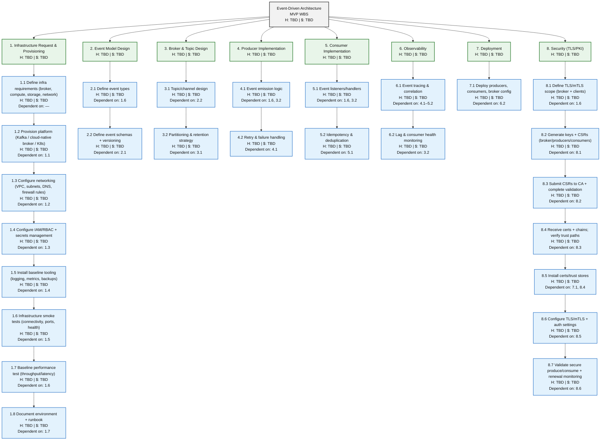
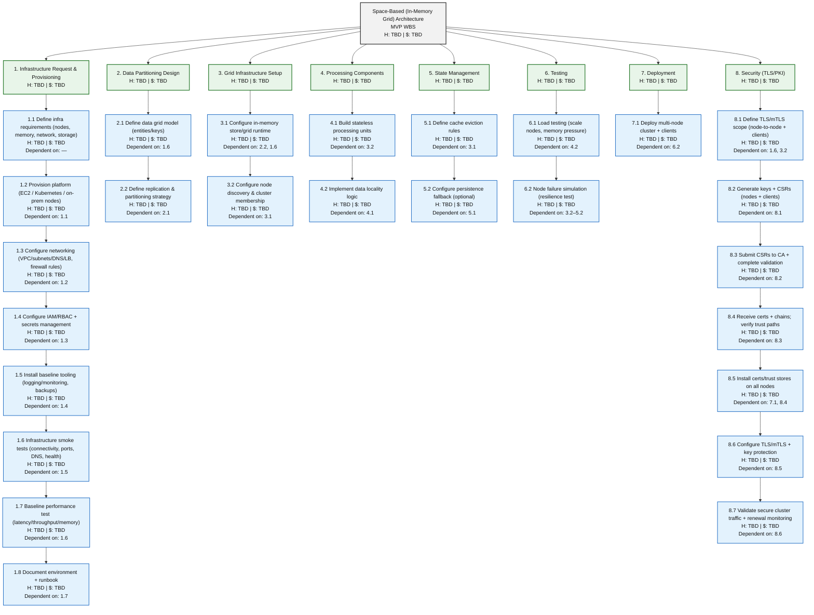
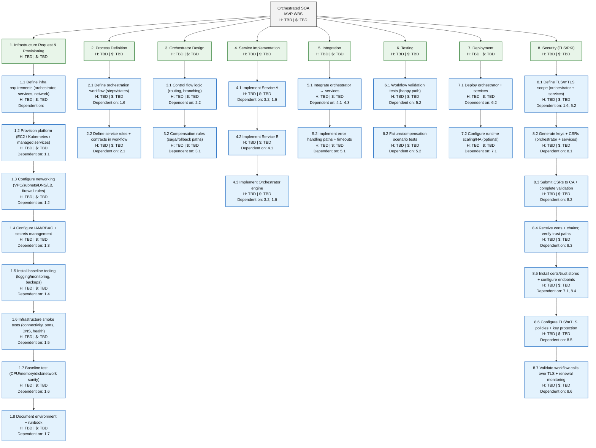
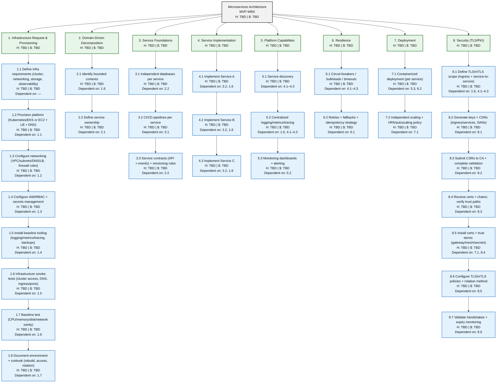

# 1) Layered Architecture (Monolith)

---

# 2) Dataflow (Pipeline) Architecture 

---

# 3) Microkernel Architecture 

---

# 4) Service-Based Architecture 

---

# 5) Event-Driven Architecture 

---

# 6) Space-Based Architecture

---

# 7) Orchestrated SOA 

---

# 8) Microservices Architecture — add PKI phase (7)

